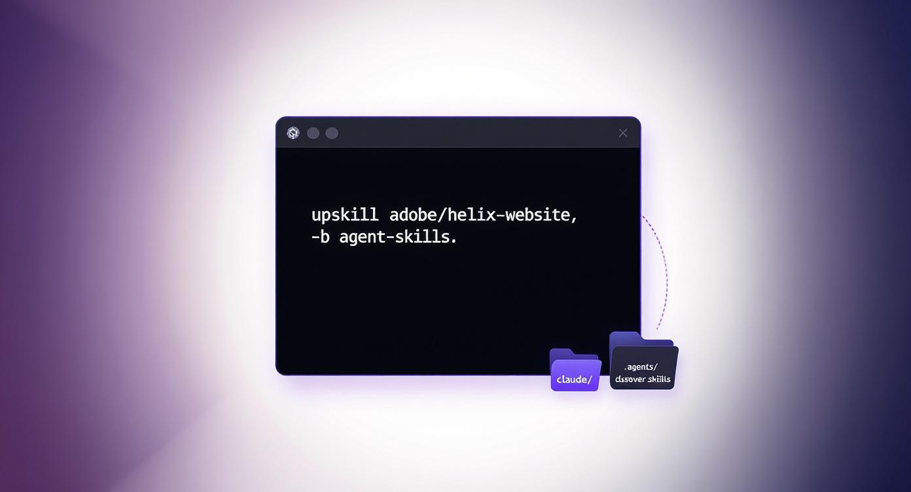

# upskill

Quickly install Claude/Agent skills from another repository. Works standalone and as a `gh` extension.

## Install

- Standalone
  - macOS/Linux: `curl -fsSL https://raw.githubusercontent.com/trieloff/upskill/main/install.sh | bash`
  - Custom prefix: `curl -fsSL https://raw.githubusercontent.com/trieloff/upskill/main/install.sh | bash -s -- --prefix ~/.local`

- GitHub CLI extension
  - `gh extension install trieloff/upskill`
  - Then run via `gh upskill ...` (or use `upskill` directly)

## Usage

Install skills from another repo (same syntax as `gh repo clone`):

```
upskill adobe/helix-website -b agent-skills
```

What this does:
- Creates a temp directory and `gh repo clone`s the source repository
- Copies everything from `source/.claude/skills` into `./.claude/skills`
- Creates `./.agents/discover-skills` (robust, shellcheck-friendly)
- Adds or updates a Skills section in `./AGENTS.md` with clear start/end markers
  - Ensures repeated runs do not duplicate the section

Options:
- `-b, --branch <branch>`: use a specific branch, tag, or commit
- `--skills-path <path>`: change source skills path (default: `.claude/skills`)
- `-i`: add created files to `.gitignore` (`.claude/skills/` and `.agents/discover-skills`), idempotent via markers

## Idempotent AGENTS.md updates

The Skills section is inserted between markers. If present, it is replaced in-place:

```
<!-- upskill:skills:start -->
... Skills content ...
<!-- upskill:skills:end -->
```

## Discover skills

After installing, list available skills in your project:

```
./.agents/discover-skills
```

This safely scans `.claude/skills/**/SKILL.md` (handles spaces) and prints names/paths/descriptions.

## Development

- Lint: `make lint` (shellcheck)
- Test: `make test` (network required for `gh repo clone`)
- CI runs lint + tests on pushes/PRs to `main`.

## Notes

- Requires `gh` CLI for cloning, `git`, and standard Unix tools.
- If the source AGENTS.md does not contain a `## Skills` section, the update is skipped.
- The generated `./.agents/discover-skills` improves robustness over the reference script (handles spaces; strict mode).
